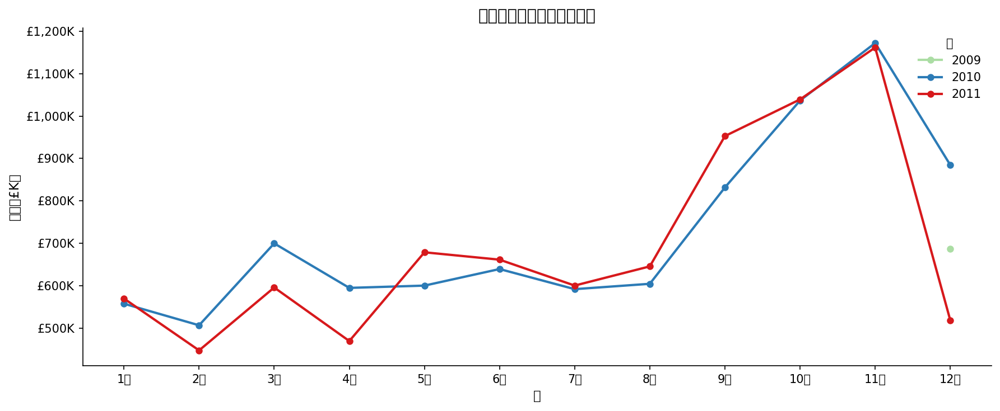
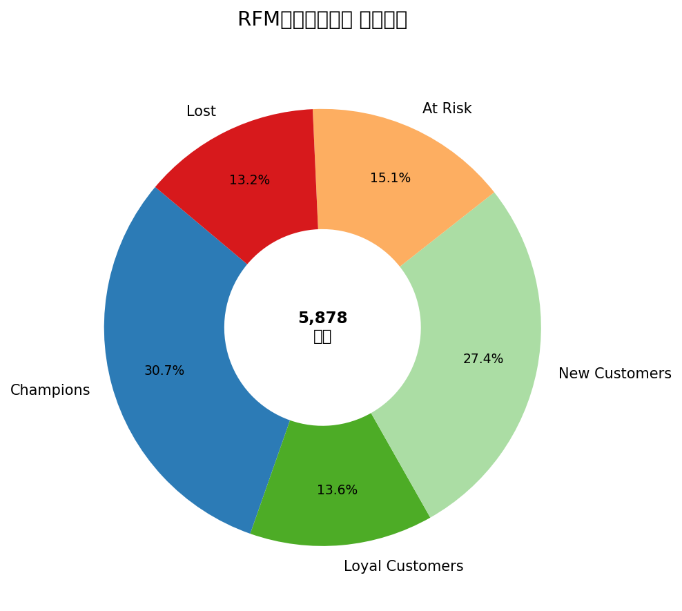
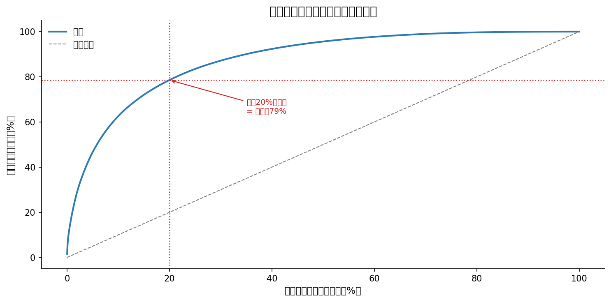
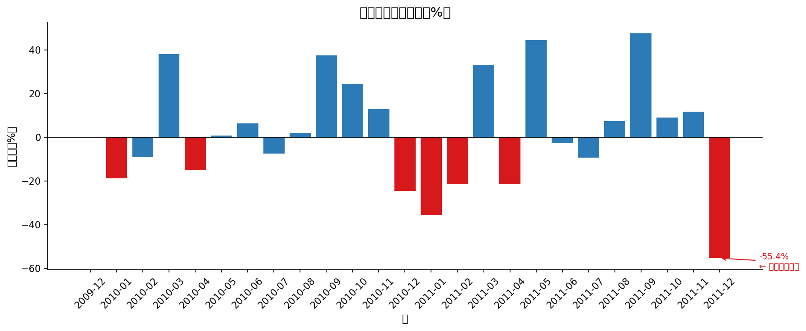

# データ分析ポートフォリオ

**現役データサイエンティストによる、わかりやすい分析・レポート作成サービス**

---

## こんなお悩みはありませんか？

- データや数字はあるけど、何をすればいいかわからない
- レポートを見ても、次のアクションが思い浮かばない
- 分析を誰かに頼みたいけど、どこに相談すればいいかわからない

**そのお悩み、ぜひご相談ください。**  
データを「使える情報」に変えて、わかりやすくお伝えします。

---

## 納品サンプル

以下は実際の分析結果の例です。このようなグラフとレポートをお届けします。

| 月別売上の推移 | 顧客グループの分布 |
|---|---|
|  |  |

| 商品別の売上集中度 | 前月比の売上変化 |
|---|---|
|  |  |

グラフには日本語の解説と「次にとるべきアクション」をセットでお届けします。

**[サンプルレポートをダウンロード（PDF）→ output/report_sample.pdf](output/report_sample.pdf)**

---

## このポートフォリオについて

あるイギリスのネット通販会社が「2年分の売上データはあるが、活かせていない」という状況から、以下の3つの問いに答える分析を行いました。

1. **売上は伸びているのか、落ちているのか？ その理由は？**
2. **どの商品が稼いでいて、どの商品が静かに落ちているのか？**
3. **どのお客様が最も大切で、それぞれに何をすればいいのか？**

データを整理するところから始めて、グラフ作成・原因分析・改善提案まで一貫して対応しています。

---

## できること一覧

| 分析の内容 | こんなときに役立ちます |
|---|---|
| 売上・業績のトレンド分析（月次・週次） | 「今、売上は上がっているのか下がっているのかわからない」 |
| 前年比・前月比の比較 | 「去年と比べてどうなのか知りたい」 |
| 売上が落ちた原因の調査 | 「先月急に数字が落ちた。なぜ？」 |
| 商品・カテゴリ別のパフォーマンス比較 | 「どの商品に力を入れるべきか整理したい」 |
| 顧客の購買パターン分析・グループ分け | 「お客様ごとに施策を変えたい」 |
| データの整理・クレンジング | 「Excelがバラバラで使えない状態」 |

---

## ご依頼の流れ

1. **Coconalaからメッセージ**をお送りください（相談無料）
2. データの内容や知りたいことをざっくりお聞きします
3. 分析・レポート作成
4. **グラフ付きレポート（PDF or Excel）**でお届け。日本語でわかりやすく解説します

> ExcelやCSVファイルをそのまま送っていただくだけでOKです。  
> 「何を見ればいいかわからない」状態からでもお気軽にご相談いただけます。

---

## 私について

グローバル半導体メーカーにてシニアデータサイエンティストとして勤務しています。売上分析・需要予測・生産データ解析・業務改善プロジェクトを日常的に担当しており、「データを使って現場の意思決定を助ける」ことを専門としています。

専門的な知識がなくても伝わるよう、結果はすべて**日本語でやさしく説明**します。

---

## ご依頼・お問い合わせ

**Coconalaにてサービスを提供しています。**  
まずはお気軽にメッセージをどうぞ。

https://coconala.com/users/6033053#services

---
---

# Data Analysis Portfolio — English Version

**Business-focused data analysis and reporting, delivered in plain language**

---

## Project Overview

This portfolio demonstrates the type of analysis and reporting delivered to clients. The scenario: a UK-based e-commerce company had two years of transaction data with no visibility into trends, product health, or customer behaviour. Starting from raw Excel data, the project answers three questions:

1. Is revenue growing, seasonal, or declining — and why?
2. Which products drive revenue, and which are quietly declining?
3. Who are the most valuable customers, and what should be done for each group?

**Dataset:** UCI Online Retail II — ~800K cleaned transactions, 2009–2011 (public domain)

---

## Analyses Included

| Analysis | What it answers |
|---|---|
| Data Cleaning & Quality Check | Is the data reliable enough to act on? |
| Monthly & Weekly Sales Trend | Is the business growing, and when does it peak? |
| Revenue Drop Investigation | Why did revenue fall last month? |
| Product Performance Ranking | Which products generate revenue, and which are declining? |
| Customer RFM Segmentation | Who are the best customers, and what should we do for each group? |
| SQL Query Examples | Runnable queries for the same analyses (SQLite / DuckDB / BigQuery) |

---

## Tech Stack

- **Python** — pandas, numpy, matplotlib, seaborn, statsmodels
- **SQL** — SQLite-compatible (also runs in DuckDB, BigQuery, Redshift)
- **Jupyter Notebooks** — analysis and narrative together
- **nbconvert** — PDF/HTML report export with code hidden

---

## How to Run

```bash
# 1. Install dependencies
pip install -r requirements.txt

# 2. Download the dataset
#    https://archive.ics.uci.edu/dataset/502/online+retail+ii
#    Save as: data/online_retail_II.xlsx

# 3. Run notebooks in order (01 → 02 → 03 → 04)
jupyter notebook
```

---

*Dataset: UCI Online Retail II — Dua, D. and Graff, C. (2019). UCI Machine Learning Repository. CC BY 4.0*
